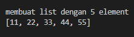
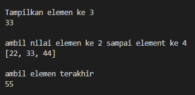
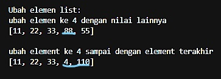
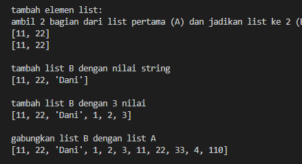
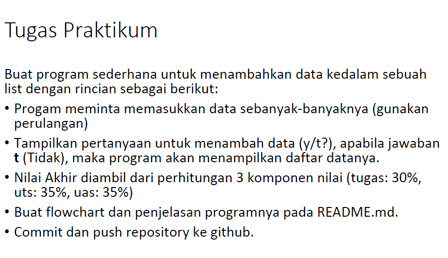
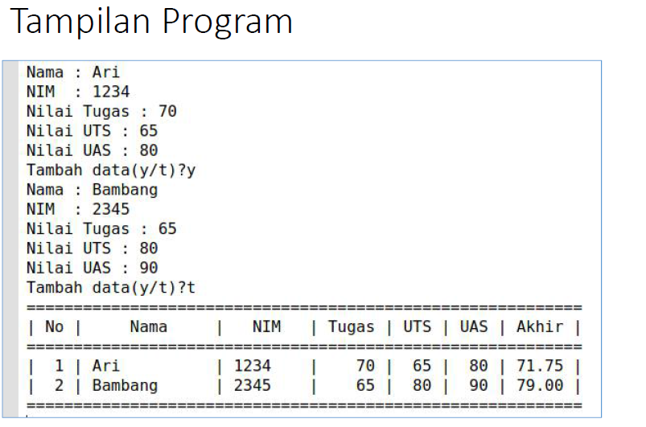
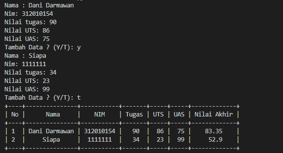
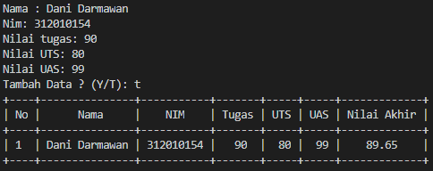
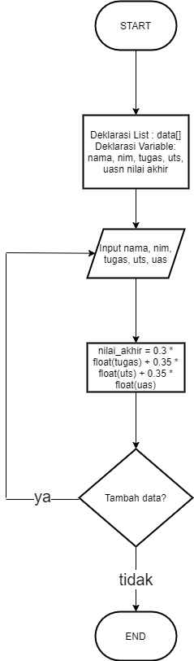

# Tugas pertemuan ke 9
Repository ini digunakan untuk memenuhi Tugas Bahasa Pemrograman - Pertemuan 9

Nama    : Dani Darmawan <br>
NIM     : 312010154 <br>
KELAS   : TI.20.B1 <br>

### DAFTAR ISI
| NO | DESCRIPTION | LINK |
| ---- | ----- | ----|
| 1 | Latihan  | [CLICK HERE](#latihan) |
| 2 | Praktikum ke 4  | [CLICK HERE](#Praktikum_Ke_4) |

## Latihan
Latihan soal pada pertemeuan ke 9 bagian ke 1 <br> 
.png) <br>
Untuk Codingan saya[CLICK HERE](latihan_p4.py)<br>

Buatlah list dengan 5 elemen dengan menggunakan syntax di bawah ini <br>
``` python
daftar=[11,22,33,44,55]
print(daftar)
```
Outputnya<br>
<br>

* 1. Akses list<br>
Tampilkan elemen ke 3 dari list atau daftar pertama<br>
``` python
print(daftar[2])
```
Kenapa jika ingin menampilakn elemen ke 3 memasukan variabel [2] karna cara mengurutkannya bukan <br>
mulai dari angka 1 melainkan dari angka 0.<br>
Contoh:<br>
Variabel 1 2 3 4 5 <br>
urutan   0 1 2 3 4  <br>

Ambil nilai elemen ke 2 sampai elemen ke 4<br>
``` python
print(daftar[1:4])
```
tanda [:] sebagai tanda **sampai dengan** dalam syntax ini element terakhir di harus di + 1 <br>

Ambil elemen terakhir
``` python
print(daftar[-1])
```
dalam syntax ini kenapa saya menggunakan [-1], cara cepat untuk menampilkan element atau variabel dari belakang<br>
tanpa harus kita capek menghitung urutannya, dan juga jika menghitung urutannya dari belakang di mulai dari [-1]<br
Contoh:<br>
Variabel 1 2 3  4  5 <br>
urutan   0 1 2 -2 -1    <br>

**Output dari Inputan di atas**


* 2. Mengubah Elemen<br>
Mengubah elemen ke 4
``` python
daftar[3] = 88
print(daftar)
```
Mengubah elemen ke 4 dan terakhir
``` python
daftar[3:5] = [4,110]
print(daftar)
```
**output dari hasil inputan di atas**

yang di garis bawah perubahannya<br>

* 3. Menambahkan elemen
Ambil 2 bagian dari list pertama menjadi lis ke 2<br>
``` python
daftar2=daftar[0:2]
print(daftar2)
```
yang di magsud syntax di atas yaitu mengambil 2 elemen ke 1 dan 2 untuk di jadikan list baru <br>
atau membuat list baru dengan menggunakan data list sebelumnya<br>

Menambahkan List baru dengan string<br>
``` python
daftar2.append("Dani")
print(daftar2)
```
Penggunaan **append** untuk menambahkan 1 data mau itu [int] atau [str]<br>

Menambahkan 3 List baru
``` python
daftar2.extend([1,2,3])
print(daftar2)
```
Penggunaan **extend** untuk menambahkan lebih dari 1 data mau itu [int] atau [str]<br>

Menggabungkan List pertama dengan ke dua <br>
``` python
satukan=daftar2+daftar
print(satukan)
```
**output Hasil dari inputan di atas**



## Praktikum_Ke_4





Untuk Codingan saya [CLICK HERE](Praktikum4.py)<br> 
``` python
from prettytable import PrettyTable
# Membuat list kosong untuk menampung
Mahasiswa = []
stop = False
i = 0

# mengisi
while(not stop):
    nama = input("Nama : ")
    nim = input("Nim: ")
    tugas = input("Nilai tugas: ")
    uts = input("Nilai UTS: ")
    uas = input("Nilai UAS: ")

    nilai_akhir = 0.3 * float(tugas) + 0.35 * float(uts) + 0.35 * float(uas)

    Mahasiswa.append([nama, nim, tugas, uts, uas, nilai_akhir])

    

    tanya= input("Tambah Data ? (Y/T): ")
    if tanya == "t":
        stop = True

x = PrettyTable()
i = 0

for data in Mahasiswa:
    i += 1
    x.field_names = ["No", "Nama", "NIM", "Tugas", "UTS", "UAS", "Nilai Akhir"]
    x.add_row([i, data[0], data[1], data[2], data[3], data[4], data[5]])
print(x)
```
**output Hasil dari inputan di atas**
Jika Ya [y]<br>


Jika Tidak [t]<br>


**Flow Chart**
